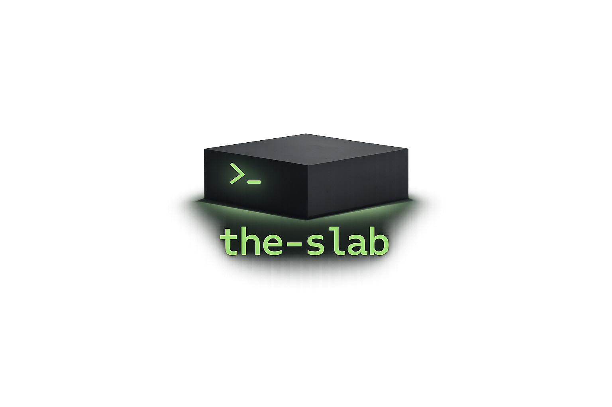

<p align="center">
  
</p>

<h1 align="center">The Slab</h1>

<p align="center">
  <strong>An offline CLI tool for local LLMs via Ollama</strong><br>
  Designed for air-gapped environments with zero external dependencies at runtime.
</p>

---

## Table of Contents

- [Table of Contents](#table-of-contents)
- [Features](#features)
- [Installation](#installation)
  - [Pre-built Binaries](#pre-built-binaries)
  - [From Source](#from-source)
    - [Building for Air-gapped Environments (musl)](#building-for-air-gapped-environments-musl)
  - [Prerequisites](#prerequisites)
- [Quick Start](#quick-start)
- [Usage](#usage)
  - [Commands](#commands)
  - [Global Options](#global-options)
  - [REPL Commands](#repl-commands)
  - [Keyboard Shortcuts](#keyboard-shortcuts)
  - [Tab Completion](#tab-completion)
  - [`@` File References](#-file-references)
- [Configuration](#configuration)
  - [Example Config](#example-config)
  - [Config Options](#config-options)
  - [Theming](#theming)
  - [Box Styles](#box-styles)
- [File Operations](#file-operations)
  - [Creating/Editing Files](#creatingediting-files)
  - [Deleting Files](#deleting-files)
  - [Auto-Apply Mode](#auto-apply-mode)
  - [Customizing the System Prompt](#customizing-the-system-prompt)
- [Templates](#templates)
  - [Built-in Variables](#built-in-variables)
- [Rules](#rules)
- [Testing](#testing)
  - [Assertion Types](#assertion-types)
- [Shell Completions](#shell-completions)
  - [Basic Completions](#basic-completions)
  - [Enhanced Completions](#enhanced-completions)
- [Project Structure](#project-structure)
- [Troubleshooting](#troubleshooting)
  - [Ollama not running](#ollama-not-running)
  - [No models available](#no-models-available)
  - [Model not found](#model-not-found)
- [License](#license)

## Features

- **100% Offline** - Works completely offline, perfect for air-gapped environments
- **Streaming Responses** - Real-time streaming output from your local models
- **File Operations** - Create and edit files directly from LLM responses with diff preview
- **Context Management** - Add files to context, track token usage
- **Prompt Templates** - Reusable templates with Handlebars syntax
- **Rules Engine** - Persistent coding guidelines injected into every conversation
- **Testing Framework** - Validate LLM responses with assertions
- **Session Management** - Save and resume conversations
- **Syntax Highlighting** - Beautiful code blocks in responses
- **Theming** - 6 built-in color themes with customizable box styles
- **`@` File References** - Inline file contents in prompts with `@filename` and tab completion
- **Smart Autocomplete** - Fish-style inline preview with fuzzy matching

## Installation

### Pre-built Binaries

Download from [GitHub Releases](https://github.com/yourusername/the-slab/releases):

| Platform | Binary | Notes |
|----------|--------|-------|
| Linux x86_64 | `slab-linux-x86_64.tar.gz` | Requires glibc 2.31+ |
| Linux x86_64 (static) | `slab-linux-x86_64-musl.tar.gz` | **Recommended for air-gapped environments** - no glibc dependency |
| macOS x86_64 | `slab-macos-x86_64.tar.gz` | Intel Macs |
| macOS ARM64 | `slab-macos-arm64.tar.gz` | Apple Silicon |

> **Air-gapped environments**: Use the `-musl` build. It's a fully static binary with zero dynamic library dependencies, compatible with any Linux kernel 2.6.32+.

### From Source

```bash
# Clone the repository
git clone https://github.com/yourusername/the-slab.git
cd the-slab

# Build release binary
cargo build --release

# Install to your PATH (optional)
cp target/release/slab ~/.local/bin/
```

#### Building for Air-gapped Environments (musl)

To build a static binary with no glibc dependency:

```bash
# Install musl toolchain (Ubuntu/Debian)
sudo apt install musl-tools

# Add the musl target
rustup target add x86_64-unknown-linux-musl

# Build static binary
cargo build --release --target x86_64-unknown-linux-musl

# The binary will be at:
# target/x86_64-unknown-linux-musl/release/slab
```

This produces a fully static binary that works on any Linux system regardless of glibc version.

### Prerequisites

- [Rust](https://rustup.rs/) 1.70+
- [Ollama](https://ollama.ai) running locally

## Quick Start

```bash
# Start Ollama (in another terminal)
ollama serve

# Pull a model
ollama pull qwen2.5:7b

# Initialize a project
slab init

# Start chatting
slab chat
```

## Usage

### Commands

```bash
slab chat                    # Start interactive REPL
slab chat --continue         # Resume last session
slab chat --session myproj   # Use named session
slab chat -f src/main.rs     # Start REPL with files pre-loaded
slab run "your prompt"       # Run single prompt
slab run -f src/ "summarize" # Run prompt with file context
slab models                  # List available models
slab sessions                # List saved sessions
slab test                    # Run prompt tests
slab init                    # Initialize .slab/ directory
slab config --show           # Show configuration
slab completions bash        # Generate shell completions
```

### Global Options

```bash
-m, --model <MODEL>    # Override default model
-c, --config <FILE>    # Use custom config file
-v, --verbose          # Enable verbose output
    --no-stream        # Disable streaming
```

### File Flag (`--file` / `-f`)

Pass files or directories into context from the command line with `-f`. Repeatable for multiple files.

```bash
# Single file
slab run -f src/main.rs "explain this code"

# Multiple files
slab chat -f src/main.rs -f src/lib.rs

# Entire directory
slab run -f src/ "summarize this project"

# Combine with @ references
slab run -f src/main.rs -f src/lib.rs "compare @main.rs and @lib.rs"
```

For `slab chat`, files are loaded into context before the REPL starts (visible via `/files`). For `slab run`, files are added to context and `@` references are expanded in the prompt.

### REPL Commands

| Command | Description |
|---------|-------------|
| `/help` | Show all commands |
| `/help <cmd>` | Detailed help for a command |
| `/exit`, `/quit`, `/q` | Exit the REPL |
| `/clear` | Clear conversation history |
| `/model [name]` | Show or change model |
| `/context` | Show context summary |
| `/tokens` | Show token usage |
| `/files` | List files in context |
| `/add <path>` | Add file or directory to context |
| `/remove <file>` | Remove file from context |
| `/fileops [on\|off]` | Toggle file operations |
| `/templates` | List available templates |
| `/rules` | Show loaded rules |

### Keyboard Shortcuts

| Key | Action |
|-----|--------|
| `Ctrl+C` | Cancel current input |
| `Ctrl+D` | Exit |
| `Ctrl+L` | Clear screen |
| `Up/Down` | Navigate command history |
| `Tab` | Show completion menu |
| `Right Arrow` | Accept inline preview |

### Tab Completion

The REPL features intelligent tab completion:

- **Command completion** - Complete `/` commands with descriptions
- **File path completion** - Complete paths for `/add` and context commands
- **Model completion** - Complete model names for `/model`
- **Fuzzy matching** - Typo-tolerant matching (e.g., `/hlp` matches `/help`)
- **Fish-style preview** - Ghost text shows the top suggestion as you type
- **Interactive menu** - Arrow keys to navigate, Enter to select
- **`@` file references** - Complete `@filename` against files in context

### `@` File References

Use `@filename` in your prompts to inline a file's content directly in the message sent to the LLM. This gives the model focused attention on a specific file without relying solely on the system context.

```text
/add src/main.rs
/add src/lib.rs

explain @main.rs
compare @src/main.rs and @src/lib.rs
```

**How it works:**

1. Add files to context with `/add` in the REPL, or `--file` / `-f` from the CLI
2. Reference them in your prompt with `@path` (e.g., `@src/main.rs`)
3. The `@` reference is expanded to the full file content before sending to the LLM
4. Tab completion works for `@` references — type `@` and press Tab to see matching files

**Matching strategy:**

- **Exact path** - `@src/main.rs` matches the context file `src/main.rs`
- **Filename only** - `@main.rs` matches `src/main.rs` if there's only one `main.rs` in context
- **No match** - If the reference doesn't resolve, it's left as-is (e.g., `@someone` in prose)

## Configuration

Configuration is loaded from (in order of priority):

1. `.slab/config.toml` (project-local)
2. `~/.config/slab/config.toml` (global)

### Example Config

```toml
ollama_host = "http://localhost:11434"
default_model = "qwen2.5:7b"
context_limit = 32768

[models.qwen]
name = "qwen2.5:7b"
temperature = 0.7
top_p = 0.9
system_prompt = "You are a helpful coding assistant."

[ui]
theme = "default"
box_style = "rounded"
streaming = true
show_status_bar = true
show_banner = false
inline_completion_preview = true
fuzzy_completion = true
max_completion_items = 10
```

### Config Options

| Key | Description | Default |
|-----|-------------|---------|
| `ollama_host` | Ollama API URL | `http://localhost:11434` |
| `default_model` | Default model to use | First available |
| `context_limit` | Max context tokens | `32768` |
| `ui.theme` | Color theme (see [Theming](#theming)) | `default` |
| `ui.box_style` | Box drawing style | `rounded` |
| `ui.streaming` | Enable streaming | `true` |
| `ui.show_status_bar` | Show model/context status bar | `true` |
| `ui.show_banner` | Show ASCII banner on startup | `false` |
| `ui.auto_apply_file_ops` | Auto-apply file operations | `false` |
| `ui.inline_completion_preview` | Show fish-style ghost text | `true` |
| `ui.fuzzy_completion` | Enable fuzzy matching | `true` |
| `ui.max_completion_items` | Max items in completion menu | `10` |
| `ui.code_block_style` | Code block rendering | `bordered` |
| `ui.diff_style` | Diff display format | `unified` |

### Theming

The Slab includes 6 built-in color themes:

| Theme | Description |
|-------|-------------|
| `default` | Cyan/blue palette (default) |
| `monokai` | Warm orange/purple palette |
| `nord` | Cool blue Nordic palette |
| `solarized` | Solarized color scheme |
| `minimal` | Grayscale with subtle colors |
| `dracula` | Purple/pink Dracula theme |

Set the theme in your config or via CLI:

```bash
slab config --set ui.theme=nord
```

### Box Styles

Customize the box drawing characters used for panels and borders:

| Style | Characters |
|-------|------------|
| `rounded` | `╭ ╮ ╰ ╯ ─ │` (default) |
| `sharp` | `┌ ┐ └ ┘ ─ │` |
| `double` | `╔ ╗ ╚ ╝ ═ ║` |
| `heavy` | `┏ ┓ ┗ ┛ ━ ┃` |
| `ascii` | `+ + + + - |` |

```bash
slab config --set ui.box_style=double
```

## File Operations

The Slab can detect file operations in LLM responses and apply them with your confirmation.

A default system prompt instructs the LLM to output files in a special format.

### Creating/Editing Files

````markdown
```rust:src/main.rs
fn main() {
    println!("Hello, world!");
}
```
````

### Deleting Files

```text
DELETE:src/old_file.rs
```

When the LLM outputs code blocks with filenames or delete markers, you'll be prompted to review and choose:

- `[a]pply` - Apply this change
- `[v]iew` - View full diff
- `[s]kip` - Skip this change
- `[A]pply all` - Apply all remaining changes

Toggle with `/fileops on` or `/fileops off`.

### Auto-Apply Mode

To automatically apply file operations without prompting:

```bash
# Enable via CLI
slab config --set ui.auto_apply_file_ops=true

# Or in config file
```

```toml
# .slab/config.toml
[ui]
auto_apply_file_ops = true
```

When enabled, all safe file operations are applied immediately. Safety checks still prevent operations outside the project root or in `.git/`.

### Customizing the System Prompt

You can customize the system prompt in your config:

```toml
# .slab/config.toml
system_prompt = """
You are a helpful coding assistant.

When creating files, use: ```language:path/to/file
When deleting files, use: DELETE:path/to/file
"""
```

## Templates

Create reusable prompt templates in `.slab/templates/`:

```yaml
# .slab/templates/review.yaml
name: code_review
command: /review
description: Review code for issues
variables:
  - name: focus
    default: all
prompt: |
  Review this code, focusing on {{focus}}:

  {{content}}

  Identify bugs, performance issues, and improvements.
```

Use in REPL:

```text
/review focus=security
```

### Built-in Variables

| Variable | Description |
|----------|-------------|
| `{{content}}` | User-provided content |
| `{{file:path}}` | Contents of a file |
| `{{files}}` | All files in context |
| `{{language}}` | Detected language |
| `{{date}}` | Current date |

## Rules

Add persistent coding guidelines in `.slab/rules/`:

```markdown
# .slab/rules/rust.md
---
name: rust_guidelines
applies_to:
  - "*.rs"
priority: 10
---

# Rust Coding Rules

- Use `thiserror` for custom error types
- No `unwrap()` in production code
- Prefer `&str` over `String` for parameters
```

Rules are automatically injected into context based on file patterns.

## Testing

Create tests in `.slab/tests/` or `tests/prompt_tests/`:

```yaml
# .slab/tests/error_handling.yaml
name: rust_error_handling
prompt: "Write a Rust function that reads a file"
assertions:
  - type: contains
    value: "Result<"
  - type: not_contains
    value: "unwrap()"
  - type: max_latency
    ms: 5000
timeout_secs: 30
tags:
  - rust
  - error-handling
```

Run tests:

```bash
slab test                        # Run all tests
slab test --filter rust          # Filter by name/tag
slab test --model qwen2.5:14b    # Test specific model
```

### Assertion Types

| Type | Description |
|------|-------------|
| `contains` | Response contains string |
| `not_contains` | Response doesn't contain string |
| `regex` | Response matches pattern |
| `not_regex` | Response doesn't match pattern |
| `valid_json` | Response is valid JSON |
| `length_between` | Response length in range |
| `max_latency` | Response time under limit |

## Shell Completions

### Basic Completions

Generate basic completions for your shell:

```bash
# Bash
mkdir -p ~/.local/share/bash-completion/completions
slab completions bash > ~/.local/share/bash-completion/completions/slab

# Zsh
mkdir -p ~/.zfunc
slab completions zsh > ~/.zfunc/_slab

# Fish
mkdir -p ~/.config/fish/completions
slab completions fish > ~/.config/fish/completions/slab.fish
```

### Enhanced Completions

For dynamic model and session completion, use the enhanced scripts in `completions/`:

```bash
# Bash - source directly or add to ~/.bashrc
source completions/slab.bash

# Zsh - copy to fpath
mkdir -p ~/.zsh/completions
cp completions/_slab ~/.zsh/completions/
# Add to ~/.zshrc: fpath=(~/.zsh/completions $fpath)

# Fish
cp completions/slab.fish ~/.config/fish/completions/
```

The enhanced completions dynamically query available models and saved sessions for accurate tab completion.

## Project Structure

```text
.slab/
├── config.toml      # Project configuration
├── templates/       # Prompt templates
├── rules/           # Coding guidelines
├── tests/           # Prompt tests
└── sessions/        # Saved sessions

completions/         # Enhanced shell completion scripts
├── slab.bash        # Bash completions
├── _slab            # Zsh completions
└── slab.fish        # Fish completions
```

## Troubleshooting

### Ollama not running

```text
Error: Failed to connect to Ollama

Suggestions:
  1. Start Ollama: ollama serve
  2. Check if it's running: curl http://localhost:11434/api/tags
```

### No models available

```bash
# Pull a model
ollama pull qwen2.5:7b

# Or a larger model for better results
ollama pull qwen2.5:32b
```

### Model not found

```bash
# List available models
slab models

# Pull the missing model
ollama pull <model-name>
```

---

## License

MIT License - See [LICENSE](LICENSE) for details.
